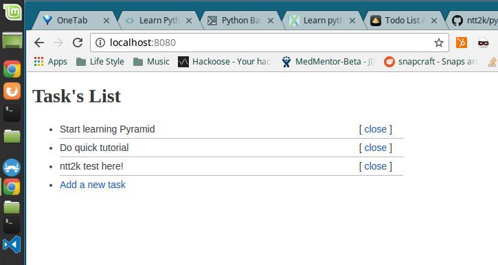

# Todo List Application in One File

This introduction to Pyramid was inspired by Flask and Bottle tutorials with the same minimalistic approach in mind. 

+ provides views to list, insert and close tasks
+ uses route patterns to match your URLs to view code functions
+ uses Mako Templates to render your views
+ stores data in an SQLite database

